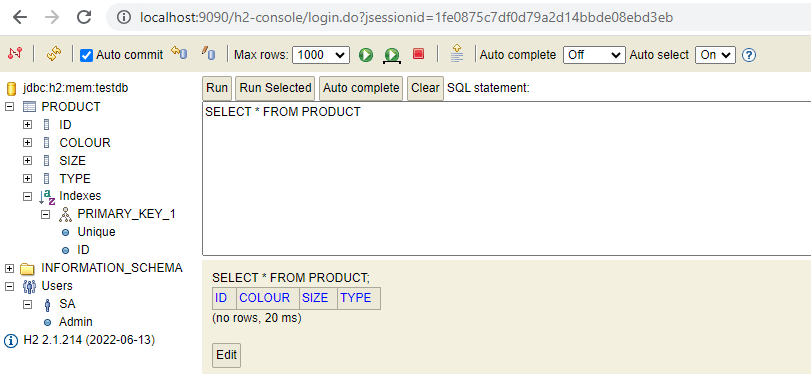

1. Create basic Springboot Application from Spring Initializer
2. Tested running it.
3. Created folder hierarchy.
4. Created basic skeleton of model,controller,repository and service.
5. Enabling h2 datasource and h2 console
6. Create the Schema to be used while bootstraping.
7. We observe that the schema is automatically created.
8. So we dont have to add schema.sql manually. 

9. Added the Swagger configuration
10. Made the changes in pom to support it.
11. Added slf4j Logger to log the information.
11. Added one POST method to add the product into DB
